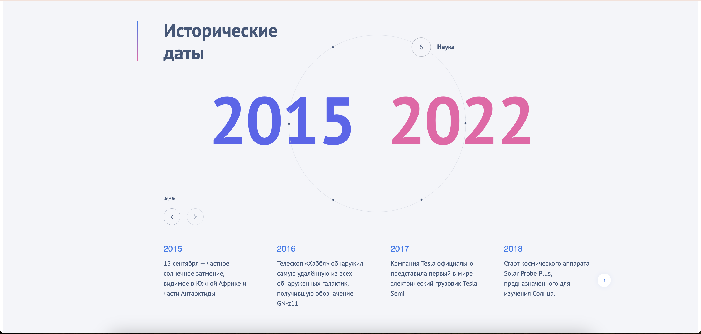

# Исторические даты - тестовое задание

## Демо
[Посмотреть демо проекта](https://my-demi-link.com)


### Как запустить проект?
1. Клонируйте проект
```bash
git clone https://github.com/AlexeyBarsukov/testing-only.git
```
2. Перейдите в директорию проекта
```bash
cd testing-only
```
3. Установите модули
```bash
npm install
```
4. Запустите проект
```bash
npm start
```
5. Откройте страницу
```bash
http://localhost:3000
```


## Используемые технологии
- **React** — библиотека для построения пользовательских интерфейсов
- **Swiper** — библиотека для создания слайдеров
- **SCSS** — для стилизации и анимаций
- **TypeScript** — добавление статической типизации


## Структура проекта
- **src/components** — основные компоненты интерфейса
- **src/pages** — страницы приложения

## Скриншоты
